### 安装时创建ceph用户：

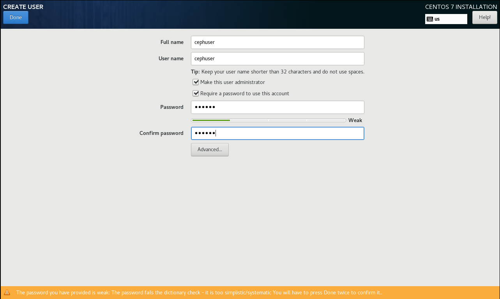

#### 安装完成进入系统：

添加sudo权限：

`echo "cephuser ALL = (root) NOPASSWD:ALL" | sudo tee /etc/sudoers.d/cephuser`

`chmod 0440 /etc/sudoers.d/cephuser`

`sed -i s'/Defaults requiretty/#Defaults requiretty'/g /etc/sudoers`

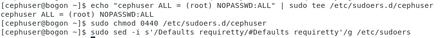

#### 安装配置ntp服务

`yum install -y ntp ntpdate ntp-doc`

`ntpdate 0.us.pool.ntp.org`

`hwclock --systohc`

`systemctl enable ntpd.service`

`systemctl start ntpd.service`

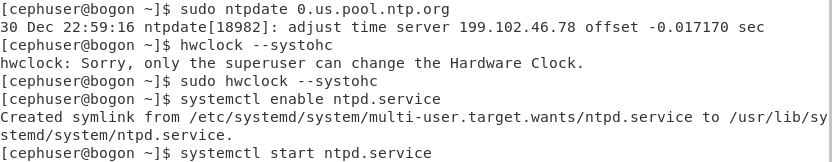

#### 安装Open-vm-tools

如果要在VMware内部运行所有节点，则需要安装此虚拟化实用程序

`yum install -y open-vm-tools`

禁用SELinux

通过使用sed流编辑器编辑SELinux配置文件，在所有节点上禁用SELinux。

`sed -i 's/SELINUX=enforcing/SELINUX=disabled/g' /etc/selinux/config`

到目前为止，全部节点相同步骤都已配置完毕，复制虚拟机

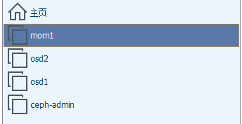

修改各个节点主机名为：

命令格式：hostnamectl set-hostname 新主机名

`hostnamectl set-hostname mon1`

`hostnamectl set-hostname osd1`

`hostnamectl set-hostname osd2`

`hostnamectl set-hostname ceph-admin`

使用vim编辑器在所有节点上编辑/ etc / hosts文件，并添加带有所有集群节点的IP地址和主机名的行。

（查看主机ip： ip addr）

`192.168.59.135 ceph-admin`

`192.168.59.136 mon1`

`192.168.59.138 osd1`

`192.168.59.137 osd2`

保存文件并退出vim。

现在，您可以尝试使用主机名在服务器之间ping通，以测试网络连接。

`ping -c 5 主机名`

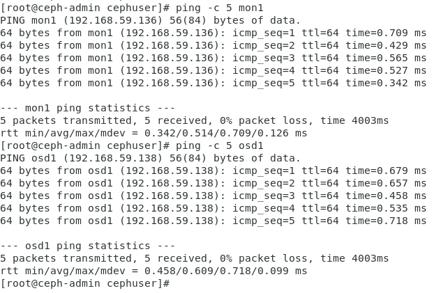

配置防火墙：

##### Ceph-admin节点：

启动firewalld，打开端口80、2003和4505-4506，然后重新加载防火墙。

`sudo systemctl start firewalld`
 `sudo systemctl enable firewalld`

`sudo firewall-cmd --zone=public --add-port=80/tcp --permanent`
 `sudo firewall-cmd --zone=public --add-port=2003/tcp --permanent`
 `sudo firewall-cmd --zone=public --add-port=4505-4506/tcp --permanent`
 `sudo firewall-cmd --reload`

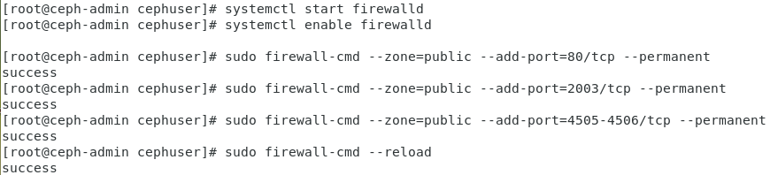

##### Mon1节点：

启动firewalld，在Ceph监视节点上打开新端口，然后重新加载防火墙。

`sudo systemctl start firewalld`
 `sudo systemctl enable firewalld`

`sudo firewall-cmd --zone=public --add-port=6789/tcp --permanent`
 `sudo firewall-cmd --reload`

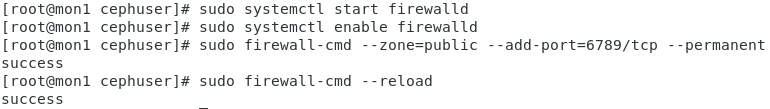

##### Osd节点：

启动firewalld，打开端口并重新加载防火墙。

`sudo systemctl start firewalld`
 `sudo systemctl enable firewalld`

`sudo firewall-cmd --zone=public --add-port=6800-7300/tcp --permanent`
 `sudo firewall-cmd --reload`

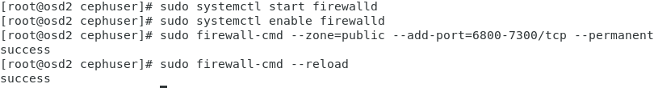

#### 为osd守护进程创建目录

osd1节点：

`sudo mkdir /var/local/osd1`

`sudo chown cephuser /var/local/osd1`

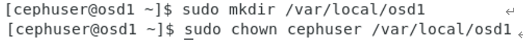

osd2节点：

`sudo mkdir /var/local/osd2`

`sudo chown cephuser /var/local/osd2`

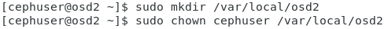

#### 在ceph-admin节点设置免密登录ssh:

`su - cephuser`

生成密钥

`ssh-keygen`

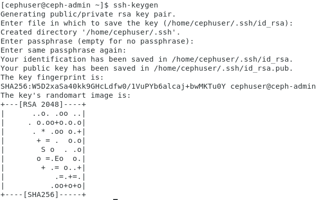

#### 为ssh配置创建配置文件

`vi ~/.ssh/config`

\#添加如下配置

`Host ceph-admin`

 `Hostname ceph-admin`

 `User cephuser`

`Host mon1`

 `Hostname mon1`

 `User cephuser`

`Host osd1`

 `Hostname osd1`

 `User cephuser`

`Host osd2`

 `Hostname osd2`

 `User cephuser`

 

更改配置文件的权限。

`chmod 644 ~/.ssh/config`

`ssh-keyscan osd1 osd2 mon1 >> ~/.ssh/known_hosts`

 

使用ssh-copy-id命令将SSH密钥添加到所有节点

分发密钥

`ssh-copy-id ceph-admin`

`ssh-copy-id mon1`

`ssh-copy-id osd1`

`ssh-copy-id osd2`

测试连接各节点ssh

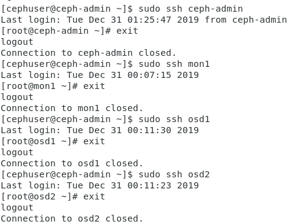

#### 在ceph-admin节点上安装ceph-deploy

`sudo rpm -Uhv http://download.ceph.com/rpm-jewel/el7/noarch/ceph-release-1-1.el7.noarch.rpm` 

`sudo yum update -y` 

`sudo yum install ceph-deploy -y`

`ceph-deploy --version`

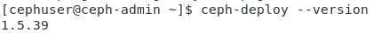

#### 创建新的集群配置

创建新的群集目录。

``mkdir cluster`
 cd cluster/`

接下来，使用“ ceph -deploy ”命令创建一个新的集群配置.

将监视节点定义为“ mon1 ”。

`sudo ceph-deploy new mon1`

用vim编辑ceph.conf文件。

`sudo vim ceph.conf`

在[global]块下，在下面粘贴配置。

\# Your network address
 `public network = 10.0.15.0/24`
 `osd pool default size = 2`

保存文件并退出vim。

##### 在各个节点安装ceph

在主节点上安装ceph

`sudo ceph-deploy install ceph-admin`

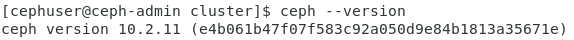

##### 在其他节点暗转ceph

出现未能解决得错误

