## 预备：

Docker命令的基本格式：

`docker [选项] [命令] [参数]`

查看docker所有的命令，键入：

`docker`

得到类似如下图所示的命令说明（图片不完全覆盖所有命令）：

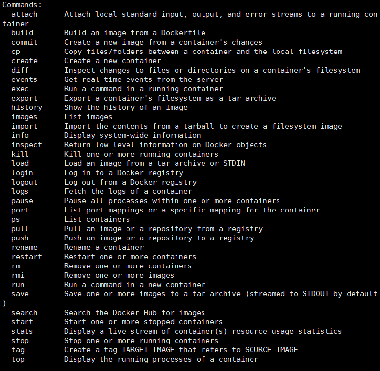

（部分截图）

特定命令的使用帮助：

`docker 特定命令 --help`

例如：`docker volume --help`

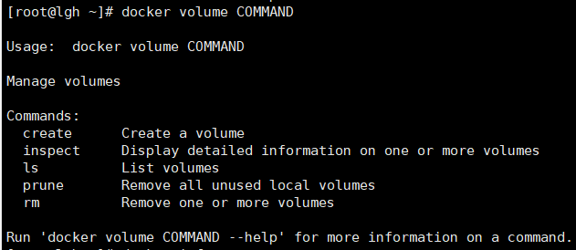

查看当前系统docker的相关信息：

`docker info`

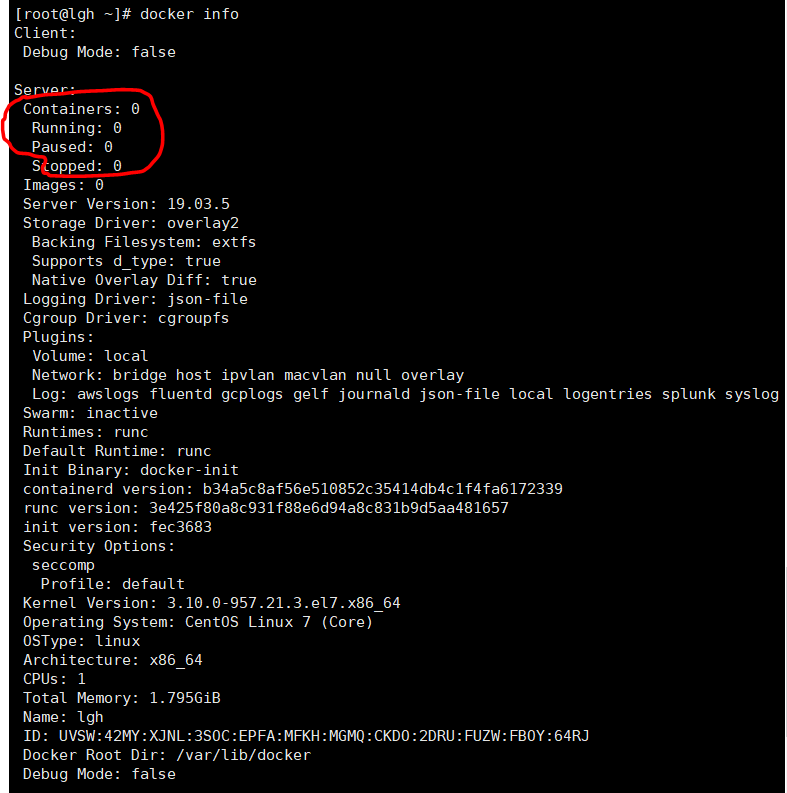

(部分截图)

可见当前并未安装任何镜像（Images），运行任何容器（Containers）。

# 加载Docker镜像

Docker镜像是容器运行的基础，默认情况下，将从Docker Hub拉取镜像。首先使用search命令查询Docker Hub中的可用镜像，这里以查询可用的CentOS镜像为例：

`docker search centos`

命令从Docker Hub拉取centos镜像的相关信息，并返回可用镜像的列表，输出结果类似于：

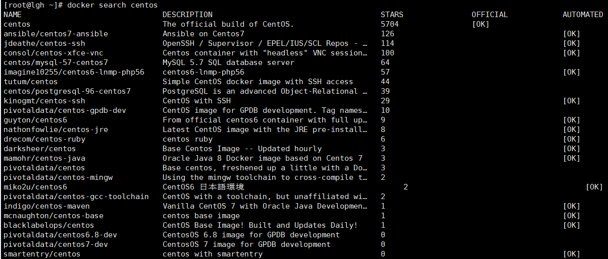

接下来拉取官方版本(OFFICIAL)的镜像：

`docker pull centos:7`

一旦镜像下载完成，可以基于该镜像运行容器，使用run命令：

`docker run -tid --privileged=true --name wordpress -p 8888:80 -d centos:7 /usr/sbin/init`

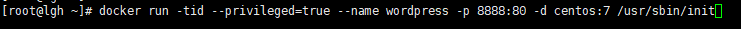

查看一下当前系统中存在的镜像：

`docker images`

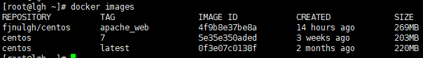

## 运行Docker容器

以上述的CentOS镜像为例运行其容器，使用-it参数进入交互shell模式：

`docker exec -it wordpress /bin/bash`

进行container内部shell，如下图所示：

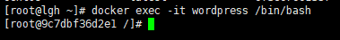

其中9c7dbf36d2e1是容器的ID，后续要用到。你可以在此shell运行任何命令，比如说：

`ls`

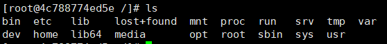

安装wordpress:详细过程查看：[https://blog.csdn.net/llfjfz/article/details/95501675](https://blog.csdn.net/llfjfz/article/details/95501675)

docker上的wordpress使用8888映射80端口：

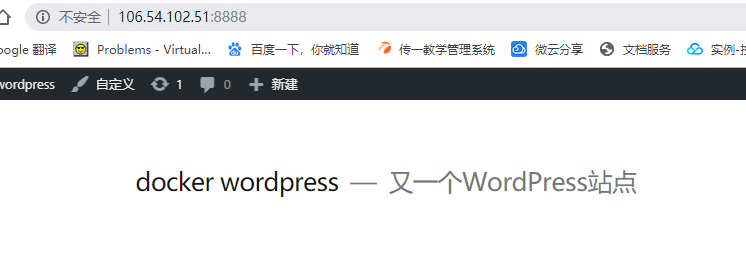

现在此容器已经安装了wordpress。注意：所有对于容器的更改只保存在当前运行的容器中，并未写入镜像。

## 创建新的镜像

在前序操作的基础上，将创建新的镜像，即提交更改到新的镜像。首先从容器的交互shell退出并保存状态，使用exit命令:

`exit`

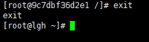

我们首先使用如下命令查看本地中的容器：

`docker ps -a`

参数-a表示列出所有容器，包含活跃的和不活跃的。输出类似下图：

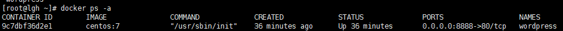

可以发现刚才运行的ID为4c788774ed5e的容器也在列表之中。
 现在使用commit命令来提交更改到新的镜像中，即创建新的镜像。命令格式

`docker commit [OPTIONS] CONTAINER [REPOSITORY[:TAG]]`

例如：

`docker commit -a “lgh” 9c7dbf36d2e1 centos:wordpress`

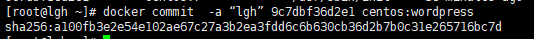

这种提交类似于git协议的提交，同样这里提交的镜像只保存在本地。后续可以提交到远程镜像仓库，比如Docker Hub。
 再次使用镜像查看命令：

`docker images`

可以看到新生成的镜像:

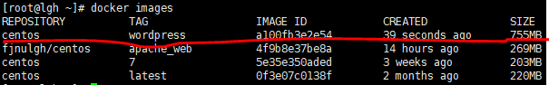

可以看到刚才创建的新镜像“centos:wordpress”，并且从大小（SIZE）来看(755MB)，区别于我们原始从Docker Hub拉取的CentOS的官方镜像(203MB)。

接下来要为新建的镜像打上标签（Tag），否则后续推送镜像到Docker Hub的时候将出现“ denied: requested access to the resource is denied”的错误。关于这个错误的解答详见[stackoverflow](https://stackoverflow.com/questions/41984399/denied-requested-access-to-the-resource-is-denied-docker)。

Tag命令的语法：

`docker tag SOURCE_IMAGE[:TAG] TARGET_IMAGE[:TAG]`

进一步细化到推送至Docker Hub的镜像，使用如下格式：

`docker tag SOURCE_IMAGE[:TAG] docker-hub-username/REPOSITORY[:TAG]`

其中hub-username是Docker Hub的用户账户，这里采用如下命令：docker hub注册可以参考[docker_hub账号注册](https://blog.csdn.net/qq_19348391/article/details/82292253))

`docker tag a100fb3e2e54 docker-hub-username /centos:wordpress`

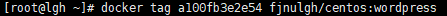

docker-hub-username替换为Docker Hub的实际用户名。这里使用镜像ID来指代想要打标签的镜像。完成之后，同样查看已存在的镜像：

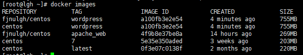

## 推送镜像到远程镜像仓库

可以把本地镜像推送到远程镜像仓库，最为著名的就是Docker官方的Docker Hub。当然比如阿里也提供容器仓库，同时也可以自己构建镜像仓库。这里以Docker Hub为例介绍如何实现镜像推送。首先要到[Docker Hub](https://hub.docker.com/)(可以参考[docker_hub账号注册](https://blog.csdn.net/qq_19348391/article/details/82292253))上进行注册，然后这里我们使用shell登录：

`docker login -u fjnulgh`

输入密码。用户名和密码都正确，随后会显示登录成功。

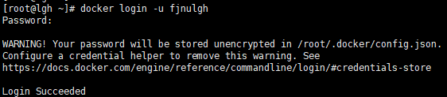

使用如下命令推送新创建的镜像：

`docker push docker-hub-username/docker-image-name`

对于本例为：

`docker push fjnulgh/centos:wordpress`

docker-hub-username替换为实际的用户名，镜像名这里使用REPOSITORY:TAG的组合。这将花费一定的时间，

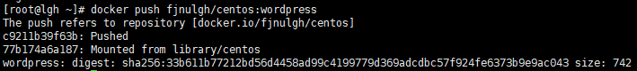

完成之后登陆Docker Hub，查看Repository，可以看到新上传的镜像。

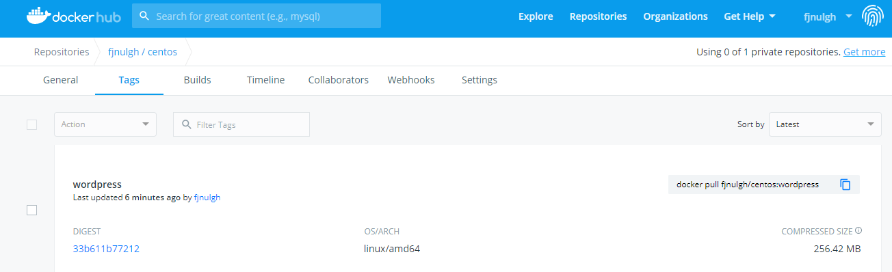

