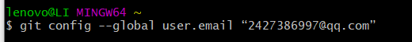

# 实验一

### 1.购买腾讯云服务器，使用web shell登录，并使用xshell登录

（1）购买腾讯云服务器

（2）在xshell中登录云服务器。

### 2.安装Git

（1）安装Git bash

​	[下载链接](https://git-scm.com/downloads)

### 创建SSH Key

先验证是否存在ssh keys

​       `ls -al ~/.ssh`

默认情况下生成的ssh key放置于“C:\Users\UserName”下的.ssh文件夹中，该命令列出该文件夹下包含的文件。常见的ssh密钥文件可能是以下文件之一：

如果密钥不存在，则新建一个：

`ssh-keygen -t rsa -b 4096 -C “your_email@example.com”`

在“C:\Users\UserName”文件夹下就会创建.ssh文件夹，文件夹中生成“id_rsa”和“id_rsa.pub”两个文件，分别对应私钥和公钥。

随后复制“id_rsa.pub”的内容到GitHub网站的Settings–>SSH and GPG keys中：

测试SSH Key是否配置成功：

`ssh -T git@github.com`

### 配置GitHub的用户名和邮箱

配置用户名 ：

git config --global user.name “your name”

配置邮箱：

`git config --global user.email “email@example.com”`

这里"email@example.com"替换成你的GitHub邮箱。

## 创建GitHub项目并在本地进行同步

### 访问GitHub网站并新建代码仓库

创建仓库：

### 创建本地代码仓库

在本地创建一个文件夹用于存放仓库，并跳到该目录下：

初始化本地文件夹作为一个Git仓库：

git init

拷贝GitHub网站中的项目网址：

添加远程代码仓库的URL：

`git remote add origin remote_repository_URL`

`remote_repository_URL`替换为刚才拷贝的项目的URL。说明，origin指代远程代码仓库（GitHub中），master表示本地的主分支。

验证一下添加是否成功：

`git remote -v`

#### 从远程代码仓库拉取数据

`git pull origin master`

#### 新建README文档

README文档是每个GitHub项目必备，说明项目内容。上文没有创建，在此处完成。

`touch README.md`

#### 推数据到远程文档

添加文件夹中的所有文件：

`git add .`

提交文件：

`git commit -m “First commit”`

注意commit只在本地提交，并未同步到远程服务器。

推送本地更新至远程服务器：

`git push -u origin master`

s

